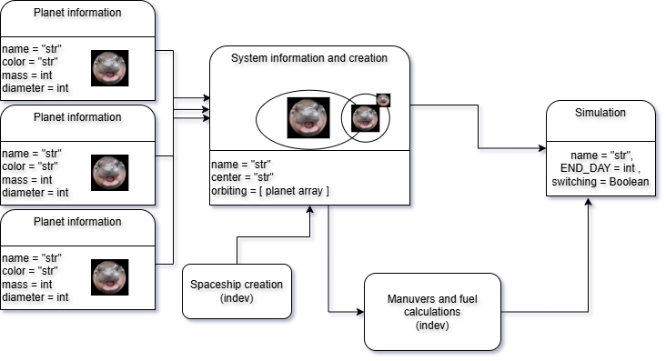

# *PyMOODENG* toolbox documentation

A toolbox for simple system simulations. 

If you use *pyMOODENG* resource, please cite:  [This](https://www.youtube.com/watch?v=xvFZjo5PgG0) as reference.

## Introduction
-----------------

*PyMOODENG* is a Python package for simple system simulations and potential transition fuel calculations. This is a project created as an excersice for a Scientific
Python course at PPKE ITK. The package aims to be user friendly, allowing users to easily set up and run simulations without needing extensive programming knowledge. It is designed to be flexible and extensible, making it suitable for a wide range of applications in the field of system simulations.

# Descripion
-----------------

The current working features, that can be used:

- Ability to define custom planetary systems and celestial bodies
- Simple visualization tools for simulation results

Other features, that are in developement:

- Support for  orbital mechanics calculations (Code implmeneted, but does not work properly with dynamic plotting)
- Support of  a rudementary fuel calualtion system (Reliant on orbital mechanics calculations)
- True gravitational attraction calculations, and representation 
- Many more features, that my appear as bugs, but are actually features
- A lot of bugs, that are not features

# Installation
-----------------

To install *PyMOODENG*, use: 
*** pip install pymoodeng ***

pip project: [pyMOODENG](https://pypi.org/project/pymoodeng/)

For more details see the [pyMOODENG example code](https://pyppg.readthedocs.io/en/latest/example_code.html)

# Requirements
-----------------

Python >= 3.11

numpy >= 2.2.4

pandas >= 2.2.3

matplotlib >= 3.10.1

pyqt5  >= 5.15.11

sphinx >= 8.2.3

sphinx_rtd_theme >= 3.0.2

scikit-learn >= 1.6.1

scipy >= 1.15.2

All the python requirements are installed when the toolbox is intalled via pip, so theres no need for additional installantions.

# Usage
-----------------

For example usage, see the [pyMOODENG example code](https://pyppg.readthedocs.io/en/latest/example_code.html)

# Documentation
-----------------

https://pymoodeng.readthedocs.io/en/latest/

